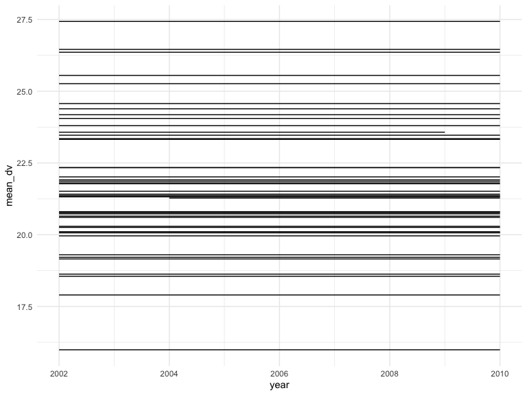
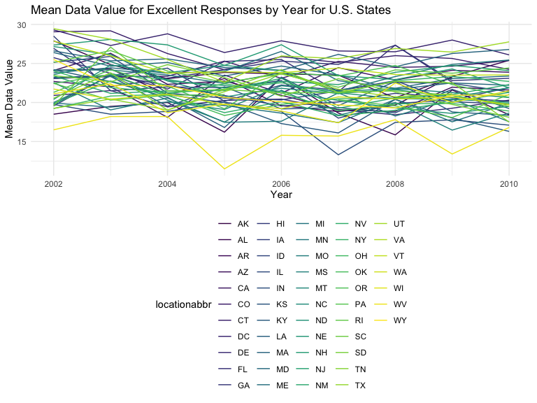
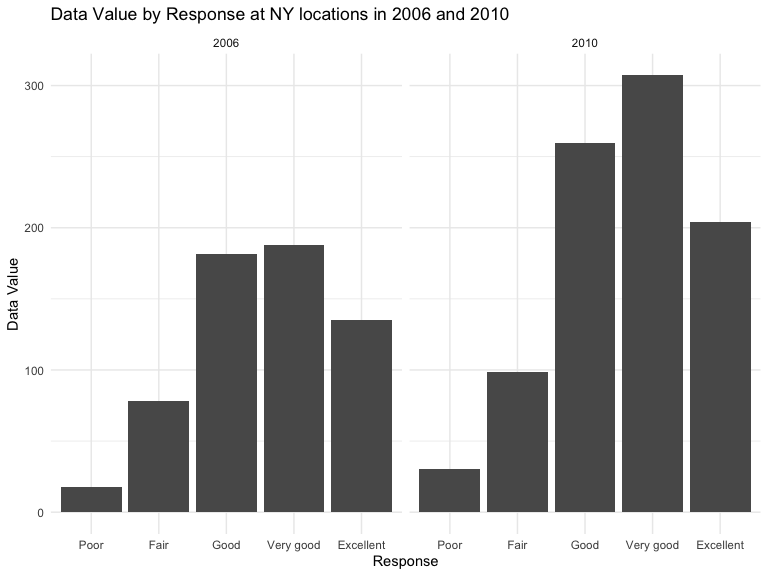
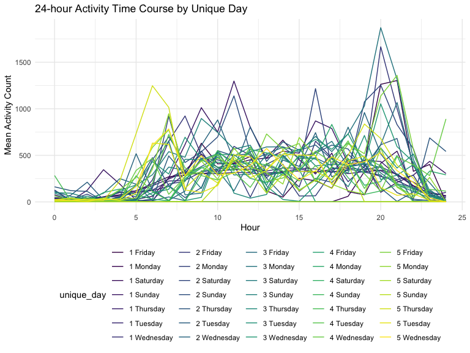
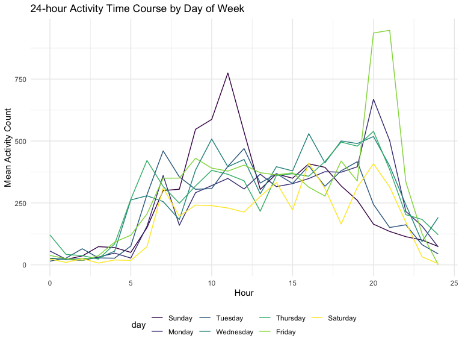

p8105\_hw3\_md3851
================
Misbath Daouda
10/3/2019

Problem 1
---------

``` r
library(p8105.datasets)
data("instacart")
head(instacart)
```

    ## # A tibble: 6 x 15
    ##   order_id product_id add_to_cart_ord… reordered user_id eval_set
    ##      <int>      <int>            <int>     <int>   <int> <chr>   
    ## 1        1      49302                1         1  112108 train   
    ## 2        1      11109                2         1  112108 train   
    ## 3        1      10246                3         0  112108 train   
    ## 4        1      49683                4         0  112108 train   
    ## 5        1      43633                5         1  112108 train   
    ## 6        1      13176                6         0  112108 train   
    ## # … with 9 more variables: order_number <int>, order_dow <int>,
    ## #   order_hour_of_day <int>, days_since_prior_order <int>,
    ## #   product_name <chr>, aisle_id <int>, department_id <int>, aisle <chr>,
    ## #   department <chr>

``` r
str(instacart)
```

    ## Classes 'tbl_df', 'tbl' and 'data.frame':    1384617 obs. of  15 variables:
    ##  $ order_id              : int  1 1 1 1 1 1 1 1 36 36 ...
    ##  $ product_id            : int  49302 11109 10246 49683 43633 13176 47209 22035 39612 19660 ...
    ##  $ add_to_cart_order     : int  1 2 3 4 5 6 7 8 1 2 ...
    ##  $ reordered             : int  1 1 0 0 1 0 0 1 0 1 ...
    ##  $ user_id               : int  112108 112108 112108 112108 112108 112108 112108 112108 79431 79431 ...
    ##  $ eval_set              : chr  "train" "train" "train" "train" ...
    ##  $ order_number          : int  4 4 4 4 4 4 4 4 23 23 ...
    ##  $ order_dow             : int  4 4 4 4 4 4 4 4 6 6 ...
    ##  $ order_hour_of_day     : int  10 10 10 10 10 10 10 10 18 18 ...
    ##  $ days_since_prior_order: int  9 9 9 9 9 9 9 9 30 30 ...
    ##  $ product_name          : chr  "Bulgarian Yogurt" "Organic 4% Milk Fat Whole Milk Cottage Cheese" "Organic Celery Hearts" "Cucumber Kirby" ...
    ##  $ aisle_id              : int  120 108 83 83 95 24 24 21 2 115 ...
    ##  $ department_id         : int  16 16 4 4 15 4 4 16 16 7 ...
    ##  $ aisle                 : chr  "yogurt" "other creams cheeses" "fresh vegetables" "fresh vegetables" ...
    ##  $ department            : chr  "dairy eggs" "dairy eggs" "produce" "produce" ...
    ##  - attr(*, "spec")=
    ##   .. cols(
    ##   ..   order_id = col_integer(),
    ##   ..   product_id = col_integer(),
    ##   ..   add_to_cart_order = col_integer(),
    ##   ..   reordered = col_integer(),
    ##   ..   user_id = col_integer(),
    ##   ..   eval_set = col_character(),
    ##   ..   order_number = col_integer(),
    ##   ..   order_dow = col_integer(),
    ##   ..   order_hour_of_day = col_integer(),
    ##   ..   days_since_prior_order = col_integer(),
    ##   ..   product_name = col_character(),
    ##   ..   aisle_id = col_integer(),
    ##   ..   department_id = col_integer(),
    ##   ..   aisle = col_character(),
    ##   ..   department = col_character()
    ##   .. )

Instacart is an online grocery service that allows customers to shop online from local stores. This dataset contains 1384617 observations of 15 variables from 131209 users. Such variables include `reordered`, a binary variable indicating if an item has been ordered by this user in the past, and `order_dow`, the day of the week on which the order was placed.

As an example of the information provided, the first order was for bulgarian yogurt. It was placed at 10 am on the fourth day of the week, and it had been 9 days since the customer had last purchased it.

``` r
#Number of aisles 
n_distinct(pull(instacart, aisle_id))
```

    ## [1] 134

``` r
#Aisles with most orders  
instacart %>% 
   group_by(aisle) %>% 
   summarize(n = n()) %>%
   mutate(
     ranking = min_rank(desc(n))
   ) %>% 
   arrange(ranking) %>%
   filter(ranking < 4)
```

    ## # A tibble: 3 x 3
    ##   aisle                           n ranking
    ##   <chr>                       <int>   <int>
    ## 1 fresh vegetables           150609       1
    ## 2 fresh fruits               150473       2
    ## 3 packaged vegetables fruits  78493       3

There are 134 aisles in this supermarket. Most items are ordered from the fresh vegetables, the fresh fruits, and the packaged vegetables and fruits aisles.

``` r
#Aisles with more than 10000 items ordered 
instacart %>% 
   group_by(aisle) %>% 
   summarize(n = n()) %>%
   filter(n > 10000) %>%
   ggplot(aes(x = aisle, y = n)) +
   geom_col() +
   theme(axis.text.x = element_text(angle = 90)) +
   labs(x = "Aisle", y = "Number of Products Ordered", title = "Number of Products Ordered by Aisle")
```



This plot shows the number of items ordered in each aisle, limiting this to aisles with more than 10000 items ordered. The aisles are presented in alphabetical order. We can see that the most demanded products are fresh produce. The demand for packaged produce and yogurt is also high compared to other items, but is only about half as high as that of fresh produce.

``` r
#Three most popular items
instacart %>%
   filter(aisle %in% c("baking ingredients", "dog food care", "packaged vegetables fruits")) %>%
   group_by(aisle, product_name) %>%
   summarize(n = n()) %>%
   mutate(ranking = rank(-n)) %>% 
   filter(ranking <= 3) %>% 
   arrange(aisle, ranking) %>% 
   knitr::kable() 
```

| aisle                      | product\_name                                 |     n|  ranking|
|:---------------------------|:----------------------------------------------|-----:|--------:|
| baking ingredients         | Light Brown Sugar                             |   499|        1|
| baking ingredients         | Pure Baking Soda                              |   387|        2|
| baking ingredients         | Cane Sugar                                    |   336|        3|
| dog food care              | Snack Sticks Chicken & Rice Recipe Dog Treats |    30|        1|
| dog food care              | Organix Chicken & Brown Rice Recipe           |    28|        2|
| dog food care              | Small Dog Biscuits                            |    26|        3|
| packaged vegetables fruits | Organic Baby Spinach                          |  9784|        1|
| packaged vegetables fruits | Organic Raspberries                           |  5546|        2|
| packaged vegetables fruits | Organic Blueberries                           |  4966|        3|

This table shows that the most popular items in the “baking ingredients”, “dog food care”, and “packaged vegetables fruits” aisles are light brown sugar, snack sticks chicken & rice recipe dog treats, and organic baby spinach respectively. Although these are the most popular items in each of these aisles, there are notable differences in the number of orders for each of them. For instance, there were 30 orders of snack sticks chicken & rice recipe dog treats versus 9784 orders of organic baby spinach.

``` r
#Apples and coffee
instacart %>% 
  filter(product_name %in% c("Pink Lady Apples", "Coffee Ice Cream")) %>%
  group_by(product_name, order_dow) %>% 
  summarize(
  mean_hr = mean(order_hour_of_day)) %>% 
  pivot_wider(
  names_from = order_dow,
  values_from = mean_hr
  ) %>%
  knitr::kable()
```

| product\_name    |         0|         1|         2|         3|         4|         5|         6|
|:-----------------|---------:|---------:|---------:|---------:|---------:|---------:|---------:|
| Coffee Ice Cream |  13.77419|  14.31579|  15.38095|  15.31818|  15.21739|  12.26316|  13.83333|
| Pink Lady Apples |  13.44118|  11.36000|  11.70213|  14.25000|  11.55172|  12.78431|  11.93750|

This table shows the mean hour of the day at which Pink Lady Apples and Coffee Ice Cream are ordered on each day of the week. On most days (except for day 5), and on average, coffee ice cream is ordered later in the afternoon than pink lady apples. This makes sense as ice cream tends to be an afternoon craving.

Problem 2
---------

``` r
library(p8105.datasets)
data("brfss_smart2010")

str(brfss_smart2010)
```

    ## Classes 'tbl_df', 'tbl' and 'data.frame':    134203 obs. of  23 variables:
    ##  $ Year                      : int  2010 2010 2010 2010 2010 2010 2010 2010 2010 2010 ...
    ##  $ Locationabbr              : chr  "AL" "AL" "AL" "AL" ...
    ##  $ Locationdesc              : chr  "AL - Jefferson County" "AL - Jefferson County" "AL - Jefferson County" "AL - Jefferson County" ...
    ##  $ Class                     : chr  "Health Status" "Health Status" "Health Status" "Health Status" ...
    ##  $ Topic                     : chr  "Overall Health" "Overall Health" "Overall Health" "Overall Health" ...
    ##  $ Question                  : chr  "How is your general health?" "How is your general health?" "How is your general health?" "How is your general health?" ...
    ##  $ Response                  : chr  "Excellent" "Very good" "Good" "Fair" ...
    ##  $ Sample_Size               : int  94 148 208 107 45 450 152 524 77 316 ...
    ##  $ Data_value                : num  18.9 30 33.1 12.5 5.5 82 18 79.3 20.7 74.9 ...
    ##  $ Confidence_limit_Low      : num  14.1 24.9 28.2 9.5 3.5 78.6 14.6 74 15.4 68.6 ...
    ##  $ Confidence_limit_High     : num  23.6 35 38 15.4 7.4 85.3 21.3 84.5 25.9 81.1 ...
    ##  $ Display_order             : int  1 2 3 4 5 6 7 8 9 10 ...
    ##  $ Data_value_unit           : chr  "%" "%" "%" "%" ...
    ##  $ Data_value_type           : chr  "Crude Prevalence" "Crude Prevalence" "Crude Prevalence" "Crude Prevalence" ...
    ##  $ Data_Value_Footnote_Symbol: chr  NA NA NA NA ...
    ##  $ Data_Value_Footnote       : chr  NA NA NA NA ...
    ##  $ DataSource                : chr  "BRFSS" "BRFSS" "BRFSS" "BRFSS" ...
    ##  $ ClassId                   : chr  "CLASS08" "CLASS08" "CLASS08" "CLASS08" ...
    ##  $ TopicId                   : chr  "Topic41" "Topic41" "Topic41" "Topic41" ...
    ##  $ LocationID                : chr  NA NA NA NA ...
    ##  $ QuestionID                : chr  "GENHLTH" "GENHLTH" "GENHLTH" "GENHLTH" ...
    ##  $ RESPID                    : chr  "RESP056" "RESP057" "RESP058" "RESP059" ...
    ##  $ GeoLocation               : chr  "(33.518601, -86.814688)" "(33.518601, -86.814688)" "(33.518601, -86.814688)" "(33.518601, -86.814688)" ...
    ##  - attr(*, "spec")=
    ##   .. cols(
    ##   ..   Year = col_integer(),
    ##   ..   Locationabbr = col_character(),
    ##   ..   Locationdesc = col_character(),
    ##   ..   Class = col_character(),
    ##   ..   Topic = col_character(),
    ##   ..   Question = col_character(),
    ##   ..   Response = col_character(),
    ##   ..   Sample_Size = col_integer(),
    ##   ..   Data_value = col_double(),
    ##   ..   Confidence_limit_Low = col_double(),
    ##   ..   Confidence_limit_High = col_double(),
    ##   ..   Display_order = col_integer(),
    ##   ..   Data_value_unit = col_character(),
    ##   ..   Data_value_type = col_character(),
    ##   ..   Data_Value_Footnote_Symbol = col_character(),
    ##   ..   Data_Value_Footnote = col_character(),
    ##   ..   DataSource = col_character(),
    ##   ..   ClassId = col_character(),
    ##   ..   TopicId = col_character(),
    ##   ..   LocationID = col_character(),
    ##   ..   QuestionID = col_character(),
    ##   ..   RESPID = col_character(),
    ##   ..   GeoLocation = col_character()
    ##   .. )

``` r
head(brfss_smart2010)
```

    ## # A tibble: 6 x 23
    ##    Year Locationabbr Locationdesc Class Topic Question Response Sample_Size
    ##   <int> <chr>        <chr>        <chr> <chr> <chr>    <chr>          <int>
    ## 1  2010 AL           AL - Jeffer… Heal… Over… How is … Excelle…          94
    ## 2  2010 AL           AL - Jeffer… Heal… Over… How is … Very go…         148
    ## 3  2010 AL           AL - Jeffer… Heal… Over… How is … Good             208
    ## 4  2010 AL           AL - Jeffer… Heal… Over… How is … Fair             107
    ## 5  2010 AL           AL - Jeffer… Heal… Over… How is … Poor              45
    ## 6  2010 AL           AL - Jeffer… Heal… Fair… Health … Good or…         450
    ## # … with 15 more variables: Data_value <dbl>, Confidence_limit_Low <dbl>,
    ## #   Confidence_limit_High <dbl>, Display_order <int>,
    ## #   Data_value_unit <chr>, Data_value_type <chr>,
    ## #   Data_Value_Footnote_Symbol <chr>, Data_Value_Footnote <chr>,
    ## #   DataSource <chr>, ClassId <chr>, TopicId <chr>, LocationID <chr>,
    ## #   QuestionID <chr>, RESPID <chr>, GeoLocation <chr>

``` r
#Cleaned dataset
brfss_cleaned = brfss_smart2010 %>%
  janitor::clean_names() %>%
  filter(topic == "Overall Health") %>% 
  filter(response %in% c("Excellent", "Very good", "Good", "Fair", "Poor")) %>%
  mutate(
    response = forcats::fct_relevel(response, c("Poor", "Fair", "Good", "Very good", "Excellent"))
  ) 
brfss_cleaned
```

    ## # A tibble: 10,625 x 23
    ##     year locationabbr locationdesc class topic question response
    ##    <int> <chr>        <chr>        <chr> <chr> <chr>    <fct>   
    ##  1  2010 AL           AL - Jeffer… Heal… Over… How is … Excelle…
    ##  2  2010 AL           AL - Jeffer… Heal… Over… How is … Very go…
    ##  3  2010 AL           AL - Jeffer… Heal… Over… How is … Good    
    ##  4  2010 AL           AL - Jeffer… Heal… Over… How is … Fair    
    ##  5  2010 AL           AL - Jeffer… Heal… Over… How is … Poor    
    ##  6  2010 AL           AL - Mobile… Heal… Over… How is … Excelle…
    ##  7  2010 AL           AL - Mobile… Heal… Over… How is … Very go…
    ##  8  2010 AL           AL - Mobile… Heal… Over… How is … Good    
    ##  9  2010 AL           AL - Mobile… Heal… Over… How is … Fair    
    ## 10  2010 AL           AL - Mobile… Heal… Over… How is … Poor    
    ## # … with 10,615 more rows, and 16 more variables: sample_size <int>,
    ## #   data_value <dbl>, confidence_limit_low <dbl>,
    ## #   confidence_limit_high <dbl>, display_order <int>,
    ## #   data_value_unit <chr>, data_value_type <chr>,
    ## #   data_value_footnote_symbol <chr>, data_value_footnote <chr>,
    ## #   data_source <chr>, class_id <chr>, topic_id <chr>, location_id <chr>,
    ## #   question_id <chr>, respid <chr>, geo_location <chr>

This data is from the Behavioral Risk Factors Surveillance System for Selected Metropolitan Area Risk Trends (SMART) for 2002-2010. BRFSS is a continuous, state-based surveillance system that collects information about modifiable risk factors for chronic diseases and other leading causes of death. This particular subset has been restricted to focus on overall health.

``` r
brfss_2002 = 
  brfss_cleaned %>%
  filter(year == 2002) %>% 
  group_by(locationabbr) %>% 
  summarize(n = n()) %>%
  filter(n >= 7)

list(pull(brfss_2002, locationabbr))
```

    ## [[1]]
    ##  [1] "AZ" "CO" "CT" "DE" "FL" "GA" "HI" "ID" "IL" "IN" "KS" "LA" "MA" "MD"
    ## [15] "ME" "MI" "MN" "MO" "NC" "NE" "NH" "NJ" "NV" "NY" "OH" "OK" "OR" "PA"
    ## [29] "RI" "SC" "SD" "TN" "TX" "UT" "VT" "WA"

``` r
brfss_2010 = 
  brfss_cleaned %>%
  filter(year == 2010) %>%
  group_by(locationabbr) %>% 
  summarize(n = n()) %>%
  filter(n >= 7) 

list(pull(brfss_2010, locationabbr))
```

    ## [[1]]
    ##  [1] "AL" "AR" "AZ" "CA" "CO" "CT" "DE" "FL" "GA" "HI" "IA" "ID" "IL" "IN"
    ## [15] "KS" "LA" "MA" "MD" "ME" "MI" "MN" "MO" "MS" "MT" "NC" "ND" "NE" "NH"
    ## [29] "NJ" "NM" "NV" "NY" "OH" "OK" "OR" "PA" "RI" "SC" "SD" "TN" "TX" "UT"
    ## [43] "VT" "WA" "WY"

In 2002, there were 36 states that appeared in 7 locations vs 45 in 2010.

``` r
brfss_excellent = 
  brfss_cleaned %>%
  filter(response == "Excellent") %>%
  group_by(locationabbr, year) %>%
  summarize(data_value_mean = mean(data_value)) %>%
  ggplot(aes(x = year, y = data_value_mean, group = locationabbr, color = locationabbr)) +
  geom_line() +
  labs(
    x = "Year",
    y = "Mean Data Value",
    title = "Mean Data Value for Excellent Responses by Year for U.S. States"
    )

brfss_excellent
```



There does not seem to be distinguishable trends regarding the changes in mean data value for excellent responses between states or over time. However, the state of WY had two particularly low mean data values for excellent responses in 2005 and 2009.

``` r
brfss_NY = 
  brfss_cleaned %>%
  filter(locationabbr == "NY", year == "2006" | year == "2010") %>%
  ggplot(aes(x = response, y = data_value)) +
  geom_col() +
  facet_grid(~year) +
  labs(x = "Response", y = "Data Value", title = "Data Value by Response at NY locations in 2006 and 2010")

brfss_NY
```



There were notable increases in the proportion of "Good", "Very good", and "Excellent" responses given across NY locations between 2006 and 2010.

Problem 3
---------

``` r
accel_data = read_csv("./data/accel_data.csv") %>%
janitor::clean_names() %>%
pivot_longer(
  activity_1:activity_1440,
  names_to = "minute",
  names_prefix = "activity_",
  values_to = "activity_count"
  ) %>%
  mutate(
    minute = as.numeric(minute),
    day = as.factor(day),
    day = forcats::fct_relevel(day, c("Sunday", "Monday", "Tuesday", "Wednesday", "Thursday", "Friday", "Saturday")),
    day_type  = if_else(day == "Saturday" | day == "Sunday", "weekend", "weekday"))
```

    ## Parsed with column specification:
    ## cols(
    ##   .default = col_double(),
    ##   day = col_character()
    ## )

    ## See spec(...) for full column specifications.

``` r
accel_data
```

    ## # A tibble: 50,400 x 6
    ##     week day_id day    minute activity_count day_type
    ##    <dbl>  <dbl> <fct>   <dbl>          <dbl> <chr>   
    ##  1     1      1 Friday      1           88.4 weekday 
    ##  2     1      1 Friday      2           82.2 weekday 
    ##  3     1      1 Friday      3           64.4 weekday 
    ##  4     1      1 Friday      4           70.0 weekday 
    ##  5     1      1 Friday      5           75.0 weekday 
    ##  6     1      1 Friday      6           66.3 weekday 
    ##  7     1      1 Friday      7           53.8 weekday 
    ##  8     1      1 Friday      8           47.8 weekday 
    ##  9     1      1 Friday      9           55.5 weekday 
    ## 10     1      1 Friday     10           43.0 weekday 
    ## # … with 50,390 more rows

This dataset contains five weeks of accelerometer data collected on a 63 year-old male with BMI 25, who was admitted to the Advanced Cardiac Care Center of Columbia University Medical Center and diagnosed with congestive heart failure (CHF). It contains 50400 observations of 6 variables. The week variables indicates ranges from 1 to 5 and indicates which of the weeks the observation was selected from. The day\_id variables attributes a unique number to each day of the monitoring period. The day variable indicates which day from Monday through Friday the observation was recorded on. The minute variable ranges from 1 to 1440 and specifies which minute of each day the observation refers to. The activity\_count variable indicates the subject's avtivity count at each minute. The day\_type variable indicates whether the observation was collected on a weekday or on a weekend.

``` r
daily_data =
  accel_data %>% 
  group_by(day_id) %>% 
  mutate(
    daily_activity = sum(activity_count)
  )%>%
  select(day_id, day, day_type, daily_activity)%>%
  distinct()%>%
  arrange(daily_activity)%>%
  knitr::kable()
  
daily_data
```

|  day\_id| day       | day\_type |  daily\_activity|
|--------:|:----------|:----------|----------------:|
|       24| Saturday  | weekend   |          1440.00|
|       31| Saturday  | weekend   |          1440.00|
|        2| Monday    | weekday   |         78828.07|
|       32| Sunday    | weekend   |        138421.00|
|       22| Friday    | weekday   |        154049.00|
|       25| Sunday    | weekend   |        260617.00|
|        9| Monday    | weekday   |        295431.00|
|        6| Tuesday   | weekday   |        307094.24|
|       27| Tuesday   | weekday   |        319568.00|
|        7| Wednesday | weekday   |        340115.01|
|       26| Thursday  | weekday   |        340291.00|
|        5| Thursday  | weekday   |        355923.64|
|       34| Tuesday   | weekday   |        367824.00|
|       19| Thursday  | weekday   |        371230.00|
|        3| Saturday  | weekend   |        376254.00|
|       20| Tuesday   | weekday   |        381507.00|
|       17| Saturday  | weekend   |        382928.00|
|       30| Monday    | weekday   |        389080.00|
|       23| Monday    | weekday   |        409450.00|
|       11| Sunday    | weekend   |        422018.00|
|       13| Tuesday   | weekday   |        423245.00|
|       28| Wednesday | weekday   |        434460.00|
|       14| Wednesday | weekday   |        440962.00|
|       35| Wednesday | weekday   |        445366.00|
|       18| Sunday    | weekend   |        467052.00|
|       15| Friday    | weekday   |        467420.00|
|       21| Wednesday | weekday   |        468869.00|
|       12| Thursday  | weekday   |        474048.00|
|        1| Friday    | weekday   |        480542.62|
|       33| Thursday  | weekday   |        549658.00|
|        8| Friday    | weekday   |        568839.00|
|       10| Saturday  | weekend   |        607175.00|
|       29| Friday    | weekday   |        620860.00|
|        4| Sunday    | weekend   |        631105.00|
|       16| Monday    | weekday   |        685910.00|

I would have anticipated that the days with the lowest level of activity would be weekend days, but it appears that one of the days with the highest level of activity (631105 counts) was a Sunday.

``` r
#First plot
accel_data %>%
mutate(
  hour = minute %/% 60,
  hour = as.integer(hour),
  unique_day = paste(week, day)  
  ) %>%
  group_by(unique_day, hour) %>%
  summarize(mean_activity_count = mean(activity_count)) %>%
  ggplot(
    aes(x = hour, y = mean_activity_count, color = unique_day)) + 
    geom_line() + 
    labs(x = "Hour", y = "Mean Activity Count", title = "24-hour Activity Time Course by Unique Day")
```



``` r
#Second plot
accel_data %>%
mutate(
  hour = minute %/% 60,
  hour = as.integer(hour),
  ) %>%
  group_by(day, hour) %>%
  summarize(mean_activity_count = mean(activity_count)) %>%
  ggplot(
    aes(x = hour, y = mean_activity_count, color = day)) + 
    geom_line() + 
    labs(x = "Hour", y = "Mean Activity Count", title = "24-hour Activity Time Course by Day of Week")
```



The two graphs above show lower levels of activity at night (when we are expecting the subject to be sleeping) and higher levels of activity during the day. In addition, peaks of activity are observed around 11am and 8pm, which could be associated with cooking meals. There are no striking differences between weekend vs week days.
