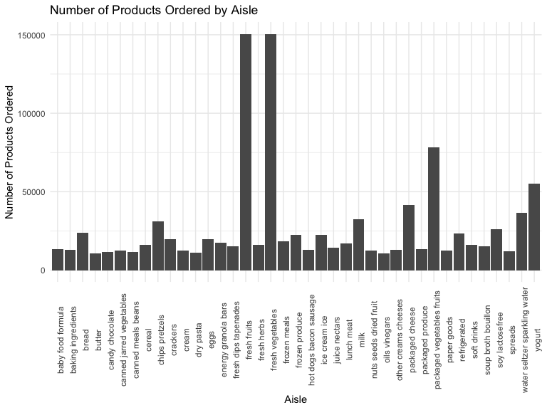
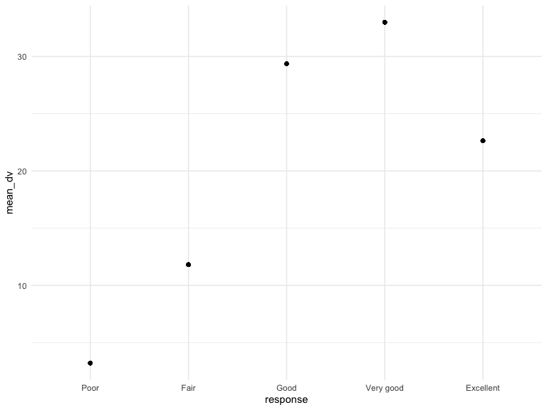

p8105\_hw3\_md3851
================
Misbath Daouda
10/3/2019

Problem 1
---------

The goal is to do some exploration of this dataset. To that end, write a short description of the dataset, noting the size and structure of the data, describing some key variables, and giving illstrative examples of observations. Then, do or answer the following (commenting on the results of each):

How many aisles are there, and which aisles are the most items ordered from?

Make a plot that shows the number of items ordered in each aisle, limiting this to aisles with more than 10000 items ordered. Arrange aisles sensibly, and organize your plot so others can read it.

Make a table showing the three most popular items in each of the aisles “baking ingredients”, “dog food care”, and “packaged vegetables fruits”. Include the number of times each item is ordered in your table.

Make a table showing the mean hour of the day at which Pink Lady Apples and Coffee Ice Cream are ordered on each day of the week; format this table for human readers (i.e. produce a 2 x 7 table).

``` r
library(p8105.datasets)
data("instacart")
instacart
```

    ## # A tibble: 1,384,617 x 15
    ##    order_id product_id add_to_cart_ord… reordered user_id eval_set
    ##       <int>      <int>            <int>     <int>   <int> <chr>   
    ##  1        1      49302                1         1  112108 train   
    ##  2        1      11109                2         1  112108 train   
    ##  3        1      10246                3         0  112108 train   
    ##  4        1      49683                4         0  112108 train   
    ##  5        1      43633                5         1  112108 train   
    ##  6        1      13176                6         0  112108 train   
    ##  7        1      47209                7         0  112108 train   
    ##  8        1      22035                8         1  112108 train   
    ##  9       36      39612                1         0   79431 train   
    ## 10       36      19660                2         1   79431 train   
    ## # … with 1,384,607 more rows, and 9 more variables: order_number <int>,
    ## #   order_dow <int>, order_hour_of_day <int>,
    ## #   days_since_prior_order <int>, product_name <chr>, aisle_id <int>,
    ## #   department_id <int>, aisle <chr>, department <chr>

``` r
head(instacart)
```

    ## # A tibble: 6 x 15
    ##   order_id product_id add_to_cart_ord… reordered user_id eval_set
    ##      <int>      <int>            <int>     <int>   <int> <chr>   
    ## 1        1      49302                1         1  112108 train   
    ## 2        1      11109                2         1  112108 train   
    ## 3        1      10246                3         0  112108 train   
    ## 4        1      49683                4         0  112108 train   
    ## 5        1      43633                5         1  112108 train   
    ## 6        1      13176                6         0  112108 train   
    ## # … with 9 more variables: order_number <int>, order_dow <int>,
    ## #   order_hour_of_day <int>, days_since_prior_order <int>,
    ## #   product_name <chr>, aisle_id <int>, department_id <int>, aisle <chr>,
    ## #   department <chr>

``` r
str(instacart)
```

    ## Classes 'tbl_df', 'tbl' and 'data.frame':    1384617 obs. of  15 variables:
    ##  $ order_id              : int  1 1 1 1 1 1 1 1 36 36 ...
    ##  $ product_id            : int  49302 11109 10246 49683 43633 13176 47209 22035 39612 19660 ...
    ##  $ add_to_cart_order     : int  1 2 3 4 5 6 7 8 1 2 ...
    ##  $ reordered             : int  1 1 0 0 1 0 0 1 0 1 ...
    ##  $ user_id               : int  112108 112108 112108 112108 112108 112108 112108 112108 79431 79431 ...
    ##  $ eval_set              : chr  "train" "train" "train" "train" ...
    ##  $ order_number          : int  4 4 4 4 4 4 4 4 23 23 ...
    ##  $ order_dow             : int  4 4 4 4 4 4 4 4 6 6 ...
    ##  $ order_hour_of_day     : int  10 10 10 10 10 10 10 10 18 18 ...
    ##  $ days_since_prior_order: int  9 9 9 9 9 9 9 9 30 30 ...
    ##  $ product_name          : chr  "Bulgarian Yogurt" "Organic 4% Milk Fat Whole Milk Cottage Cheese" "Organic Celery Hearts" "Cucumber Kirby" ...
    ##  $ aisle_id              : int  120 108 83 83 95 24 24 21 2 115 ...
    ##  $ department_id         : int  16 16 4 4 15 4 4 16 16 7 ...
    ##  $ aisle                 : chr  "yogurt" "other creams cheeses" "fresh vegetables" "fresh vegetables" ...
    ##  $ department            : chr  "dairy eggs" "dairy eggs" "produce" "produce" ...
    ##  - attr(*, "spec")=
    ##   .. cols(
    ##   ..   order_id = col_integer(),
    ##   ..   product_id = col_integer(),
    ##   ..   add_to_cart_order = col_integer(),
    ##   ..   reordered = col_integer(),
    ##   ..   user_id = col_integer(),
    ##   ..   eval_set = col_character(),
    ##   ..   order_number = col_integer(),
    ##   ..   order_dow = col_integer(),
    ##   ..   order_hour_of_day = col_integer(),
    ##   ..   days_since_prior_order = col_integer(),
    ##   ..   product_name = col_character(),
    ##   ..   aisle_id = col_integer(),
    ##   ..   department_id = col_integer(),
    ##   ..   aisle = col_character(),
    ##   ..   department = col_character()
    ##   .. )

The `cart_data` contains information on over 3 million online grocery orders from more than 200,000 Instacart users. Instacart is an online grocery service that allows customers to shop online from local stores. This dataset contains 1384617 observations of 15 variables. Examples of such variables include `reordered`, a binary variable indicating if an item has been ordered by this user in the past, and `order_dow`, the day of the week on which the order was placed.

``` r
#Number of aisles 
length(unique(unlist(instacart[c("aisle")])))
```

    ## [1] 134

``` r
#n_distinct(pull(instacart, aisle_id))

#Most items ordered from which aisles 
instacart %>% 
   group_by(aisle) %>% 
   summarize(n = n()) %>%
   mutate(
     ranking = min_rank(desc(n))
   ) %>% 
   filter(ranking < 4)
```

    ## # A tibble: 3 x 3
    ##   aisle                           n ranking
    ##   <chr>                       <int>   <int>
    ## 1 fresh fruits               150473       2
    ## 2 fresh vegetables           150609       1
    ## 3 packaged vegetables fruits  78493       3

``` r
#Aisles with more than 1000 items ordered 
instacart %>% 
   group_by(aisle) %>% 
   summarize(n = n()) %>%
   filter(n > 10000) %>%
   ggplot(aes(x = aisle, y = n)) + geom_col()
```


``` r
#Three most popular items
instacart %>%
   filter(aisle %in% c("baking ingredients", "dog food care", "packaged vegetables fruits")) %>%
   group_by(aisle, product_name) %>%
   summarize(n = n()) %>%
   mutate(ranking = rank(-n)) %>% 
   filter(ranking <= 3) %>% 
   arrange(aisle, ranking) %>% 
   knitr::kable(digits = 1) 
```

| aisle                      | product\_name                                 |     n|  ranking|
|:---------------------------|:----------------------------------------------|-----:|--------:|
| baking ingredients         | Light Brown Sugar                             |   499|        1|
| baking ingredients         | Pure Baking Soda                              |   387|        2|
| baking ingredients         | Cane Sugar                                    |   336|        3|
| dog food care              | Snack Sticks Chicken & Rice Recipe Dog Treats |    30|        1|
| dog food care              | Organix Chicken & Brown Rice Recipe           |    28|        2|
| dog food care              | Small Dog Biscuits                            |    26|        3|
| packaged vegetables fruits | Organic Baby Spinach                          |  9784|        1|
| packaged vegetables fruits | Organic Raspberries                           |  5546|        2|
| packaged vegetables fruits | Organic Blueberries                           |  4966|        3|

``` r
#Apples and coffee
instacart %>% 
  filter(product_name %in% c("Pink Lady Apples", "Coffee Ice Cream")) %>%
  group_by(product_name, order_dow) %>% 
  summarize(
  mean_hr = mean(order_hour_of_day)) %>% 
  pivot_wider(
  names_from = order_dow,
  values_from = mean_hr
  ) %>%
  knitr::kable()
```

| product\_name    |         0|         1|         2|         3|         4|         5|         6|
|:-----------------|---------:|---------:|---------:|---------:|---------:|---------:|---------:|
| Coffee Ice Cream |  13.77419|  14.31579|  15.38095|  15.31818|  15.21739|  12.26316|  13.83333|
| Pink Lady Apples |  13.44118|  11.36000|  11.70213|  14.25000|  11.55172|  12.78431|  11.93750|

There are 134 aisles in the supermarket. Most items are ordered from the fresh vegetables (150609), fresh fruits (150473), and packaged vegetables/fruits (78493) ailes.

Problem 2
---------

``` r
library(p8105.datasets)
data("brfss_smart2010")

str(brfss_smart2010)
```

    ## Classes 'tbl_df', 'tbl' and 'data.frame':    134203 obs. of  23 variables:
    ##  $ Year                      : int  2010 2010 2010 2010 2010 2010 2010 2010 2010 2010 ...
    ##  $ Locationabbr              : chr  "AL" "AL" "AL" "AL" ...
    ##  $ Locationdesc              : chr  "AL - Jefferson County" "AL - Jefferson County" "AL - Jefferson County" "AL - Jefferson County" ...
    ##  $ Class                     : chr  "Health Status" "Health Status" "Health Status" "Health Status" ...
    ##  $ Topic                     : chr  "Overall Health" "Overall Health" "Overall Health" "Overall Health" ...
    ##  $ Question                  : chr  "How is your general health?" "How is your general health?" "How is your general health?" "How is your general health?" ...
    ##  $ Response                  : chr  "Excellent" "Very good" "Good" "Fair" ...
    ##  $ Sample_Size               : int  94 148 208 107 45 450 152 524 77 316 ...
    ##  $ Data_value                : num  18.9 30 33.1 12.5 5.5 82 18 79.3 20.7 74.9 ...
    ##  $ Confidence_limit_Low      : num  14.1 24.9 28.2 9.5 3.5 78.6 14.6 74 15.4 68.6 ...
    ##  $ Confidence_limit_High     : num  23.6 35 38 15.4 7.4 85.3 21.3 84.5 25.9 81.1 ...
    ##  $ Display_order             : int  1 2 3 4 5 6 7 8 9 10 ...
    ##  $ Data_value_unit           : chr  "%" "%" "%" "%" ...
    ##  $ Data_value_type           : chr  "Crude Prevalence" "Crude Prevalence" "Crude Prevalence" "Crude Prevalence" ...
    ##  $ Data_Value_Footnote_Symbol: chr  NA NA NA NA ...
    ##  $ Data_Value_Footnote       : chr  NA NA NA NA ...
    ##  $ DataSource                : chr  "BRFSS" "BRFSS" "BRFSS" "BRFSS" ...
    ##  $ ClassId                   : chr  "CLASS08" "CLASS08" "CLASS08" "CLASS08" ...
    ##  $ TopicId                   : chr  "Topic41" "Topic41" "Topic41" "Topic41" ...
    ##  $ LocationID                : chr  NA NA NA NA ...
    ##  $ QuestionID                : chr  "GENHLTH" "GENHLTH" "GENHLTH" "GENHLTH" ...
    ##  $ RESPID                    : chr  "RESP056" "RESP057" "RESP058" "RESP059" ...
    ##  $ GeoLocation               : chr  "(33.518601, -86.814688)" "(33.518601, -86.814688)" "(33.518601, -86.814688)" "(33.518601, -86.814688)" ...
    ##  - attr(*, "spec")=
    ##   .. cols(
    ##   ..   Year = col_integer(),
    ##   ..   Locationabbr = col_character(),
    ##   ..   Locationdesc = col_character(),
    ##   ..   Class = col_character(),
    ##   ..   Topic = col_character(),
    ##   ..   Question = col_character(),
    ##   ..   Response = col_character(),
    ##   ..   Sample_Size = col_integer(),
    ##   ..   Data_value = col_double(),
    ##   ..   Confidence_limit_Low = col_double(),
    ##   ..   Confidence_limit_High = col_double(),
    ##   ..   Display_order = col_integer(),
    ##   ..   Data_value_unit = col_character(),
    ##   ..   Data_value_type = col_character(),
    ##   ..   Data_Value_Footnote_Symbol = col_character(),
    ##   ..   Data_Value_Footnote = col_character(),
    ##   ..   DataSource = col_character(),
    ##   ..   ClassId = col_character(),
    ##   ..   TopicId = col_character(),
    ##   ..   LocationID = col_character(),
    ##   ..   QuestionID = col_character(),
    ##   ..   RESPID = col_character(),
    ##   ..   GeoLocation = col_character()
    ##   .. )

``` r
head(brfss_smart2010)
```

    ## # A tibble: 6 x 23
    ##    Year Locationabbr Locationdesc Class Topic Question Response Sample_Size
    ##   <int> <chr>        <chr>        <chr> <chr> <chr>    <chr>          <int>
    ## 1  2010 AL           AL - Jeffer… Heal… Over… How is … Excelle…          94
    ## 2  2010 AL           AL - Jeffer… Heal… Over… How is … Very go…         148
    ## 3  2010 AL           AL - Jeffer… Heal… Over… How is … Good             208
    ## 4  2010 AL           AL - Jeffer… Heal… Over… How is … Fair             107
    ## 5  2010 AL           AL - Jeffer… Heal… Over… How is … Poor              45
    ## 6  2010 AL           AL - Jeffer… Heal… Fair… Health … Good or…         450
    ## # … with 15 more variables: Data_value <dbl>, Confidence_limit_Low <dbl>,
    ## #   Confidence_limit_High <dbl>, Display_order <int>,
    ## #   Data_value_unit <chr>, Data_value_type <chr>,
    ## #   Data_Value_Footnote_Symbol <chr>, Data_Value_Footnote <chr>,
    ## #   DataSource <chr>, ClassId <chr>, TopicId <chr>, LocationID <chr>,
    ## #   QuestionID <chr>, RESPID <chr>, GeoLocation <chr>

``` r
#Cleaning 

brfss_cleaned = brfss_smart2010 %>%
  janitor::clean_names() %>%
  filter(topic == "Overall Health") %>% 
  filter(response %in% c("Excellent", "Very good", "Good", "Fair", "Poor")) %>%
  mutate(
    response = forcats::fct_relevel(response, c("Poor", "Fair", "Good", "Very good", "Excellent"))
  ) %>% 
  view()

#Answering questions 

brfss_2002 = 
  brfss_cleaned %>%
  filter(year == 2002) %>% 
  group_by(locationabbr) %>% 
  summarize(n = n()) %>%
  filter(n >= 7)

list(pull(brfss_2002, locationabbr))
```

    ## [[1]]
    ##  [1] "AZ" "CO" "CT" "DE" "FL" "GA" "HI" "ID" "IL" "IN" "KS" "LA" "MA" "MD"
    ## [15] "ME" "MI" "MN" "MO" "NC" "NE" "NH" "NJ" "NV" "NY" "OH" "OK" "OR" "PA"
    ## [29] "RI" "SC" "SD" "TN" "TX" "UT" "VT" "WA"

``` r
brfss_2010 = 
  brfss_cleaned %>%
  filter(year == 2010) %>%
  group_by(locationabbr) %>% 
  summarize(n = n()) %>%
  filter(n >= 7) 

list(pull(brfss_2010, locationabbr))
```

    ## [[1]]
    ##  [1] "AL" "AR" "AZ" "CA" "CO" "CT" "DE" "FL" "GA" "HI" "IA" "ID" "IL" "IN"
    ## [15] "KS" "LA" "MA" "MD" "ME" "MI" "MN" "MO" "MS" "MT" "NC" "ND" "NE" "NH"
    ## [29] "NJ" "NM" "NV" "NY" "OH" "OK" "OR" "PA" "RI" "SC" "SD" "TN" "TX" "UT"
    ## [43] "VT" "WA" "WY"

``` r
brfss_excellent = 
  brfss_cleaned %>%
  select(response, year, locationabbr, data_value) %>%
  filter(response == "Excellent") %>% 
  group_by(locationabbr) %>% 
  mutate(
    mean_dv = mean(data_value)
  ) %>%
  select(-data_value) %>%
  distinct() %>%
  view()
 
spaghetti_plot = brfss_excellent %>% 
  ggplot(aes(x = year, y = mean_dv, group = locationabbr)) + geom_line()
spaghetti_plot
```



``` r
brfss_NY = 
  brfss_cleaned %>%
  filter(year == "2006" | year == "2010") %>%
  filter(locationabbr == "NY") %>%
  select(response, year, locationdesc, data_value) %>%
  group_by(response) %>% 
  mutate(
    mean_dv = mean(data_value)
  ) %>%
  select(-data_value) %>%
  distinct() %>%
  view()

NY_plot = brfss_NY %>% 
  ggplot(aes(x = response, y = mean_dv, group = locationdesc)) +
  geom_point() 

NY_plot
```



Problem 3
---------

``` r
accel_data = read_csv("./data/accel_data.csv") %>%
janitor::clean_names() %>%
pivot_longer(
  activity_1:activity_1440,
  names_to = "minute",
  names_prefix = "activity_",
  values_to = "activity_counts"
  )%>%
  mutate(weekend = if_else(day == "Saturday" | day == "Sunday", "weekend", "weekday"))
```

    ## Parsed with column specification:
    ## cols(
    ##   .default = col_double(),
    ##   day = col_character()
    ## )

    ## See spec(...) for full column specifications.

``` r
view(accel_data)

daily_data =
  accel_data %>% 
  group_by(day_id) %>% 
  mutate(
    daily_activity = sum(activity_counts)
  )%>%
  select(day_id, day, weekend, daily_activity)%>%
  distinct()
  
view(daily_data)
```
